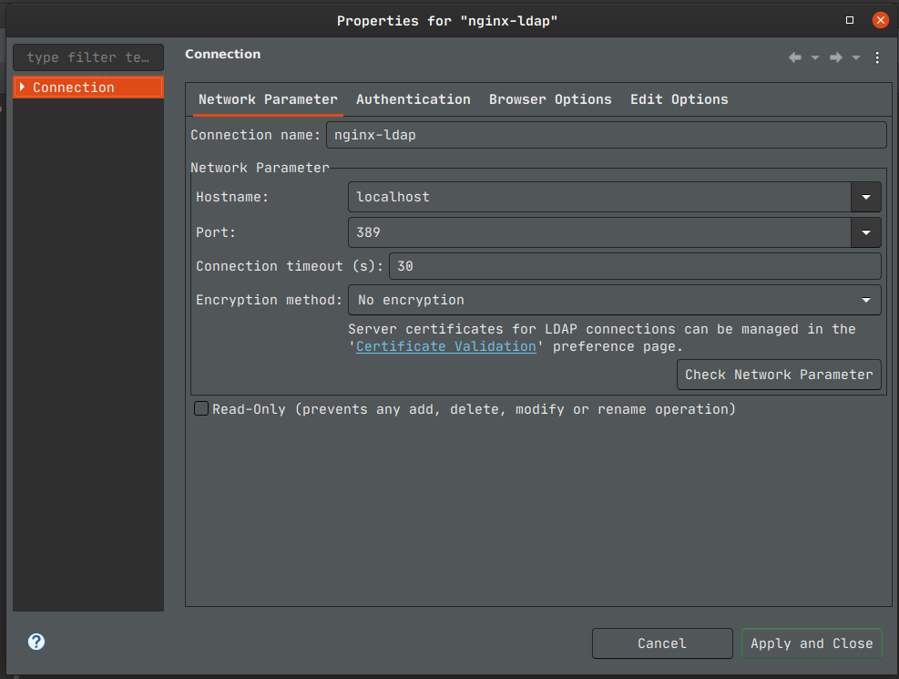
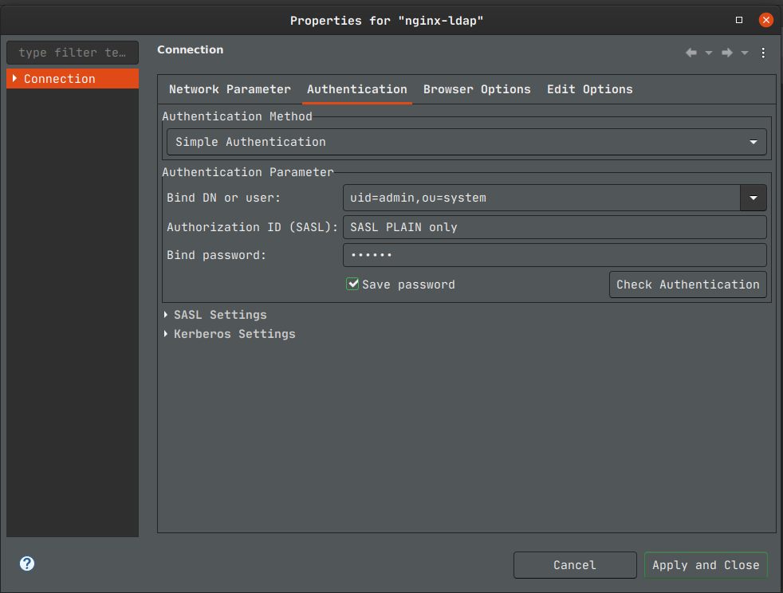

# nginx-ldap

Example of how to configure Nginx load balancer for a LDAP servers by ip hash configuration.

## Run it

```bash
git clone

cd

docker-compose build

docker-compose up -d

docker-compose logs -f

```

## How to login ?

I used Apache [Directory Studio](https://directory.apache.org/studio)


**hostname:** localhost

**port:** 389

**user:** uid=admin,ou=system

**password:** secret





## Fonts:

* https://www.youtube.com/watch?v=QhUSSxvvwjE

* https://hub.docker.com/r/openmicroscopy/apacheds/


## Limitations:

  * This a demo and the two  ldap servers not share any information, they have the same information and works for the demo.
